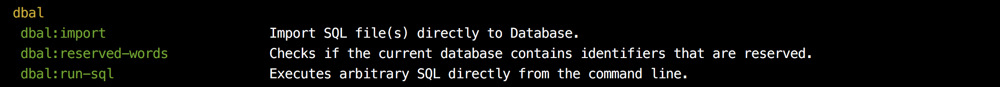

# Nettrine / DBAL

## Content

- [Installation - how to install](#installation)
- [Configuration - basic setup](#configuration)
- [Usage](#usage)
- [Bridges](#bridges)
    - [Symfony\Console](#symfony-console)

## Installation

At first you have to setup extension.

```yaml
extensions:
    dbal: Nettrine\Dbal\DI\DbalExtension
```

There are also some bridges as Symfony\Console. You'll known in next sections.

## Configuration

Minimal configuration could looks like this.

```yaml
dbal:
    debug: %debugMode%
    connection:
        host: localhost
        driver: mysqli
        dbname: nettrine
        user: root
        password: root
```

Full configuration options:

```yaml
dbal:
    debug: %debugMode%
    configuration:
        sqlLogger: NULL
        resultCacheImpl: NULL
        filterSchemaAssetsExpression: NULL
        autoCommit: TRUE
    
    connection:
        url: NULL
        driver: pdo_mysql
        driverClass: NULL
        host: NULL
        dbname: NULL
        servicename: NULL
        user: NULL
        password: NULL
        charset: UTF8
        portability: PortabilityConnection::PORTABILITY_ALL
        fetchCase: PDO::CASE_LOWER
        persistent: TRUE
        types: []
```

### Types

Here is a example how to custom type. For more information, follow the official documention.

- http://docs.doctrine-project.org/projects/doctrine-dbal/en/latest/reference/types.html
- http://docs.doctrine-project.org/projects/doctrine-orm/en/latest/cookbook/custom-mapping-types.html

```
dbal:
    connection:
        types:
            my_type:
                class: App\YourType
                commented: false/true
```

## Bridges

### Symfony\Console

This package works pretty well with [Symfony/Console](https://symfony.com/doc/current/components/console.html). Take a look at [Contributte/Console](https://github.com/contributte/console)
tiny integration for Nette Framework.

```yaml
extensions:
    # Console
    console: Contributte\Console\DI\ConsoleExtension

    # Dbal
    dbal: Nettrine\Dbal\DI\DbalExtension
    dbal.console: Nettrine\Dbal\DI\DbalConsoleExtension
```

From this moment when you type `bin/console`, there'll be registered commands from Doctrine DBAL.


